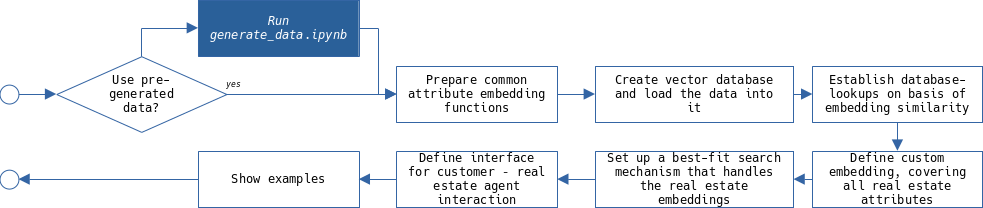

# Personal real estate agent

This project demonstrates collaborative techniques for utilization of modern AI composing a full GenAI product. It is about the usage of a large language model, vector databases an artificial data generation, for elaborating its capablities to be integrated in a virtual situation. More specifically this is about a real estate agent that provides suitable offers specifically taylored to the individual kind and requests of each individual customer.

_"A real estate agency" image generated by OpenAI’s DALL·E 3, December 28, 2024_

## 1 Structure

This project comes with three major code files:

- `real_estate_agent.ipynb`: main program
- `generate_data.ipynb`: externalized, optional, artificial data generation pipeline
- `Common.py`: a set of helper items that is shared amongst both jupyter notebooks

### 1.1 General machine preparations

There are two prerequisits to be met:
- Firstly, in order to run the code the utilization of virtual environments is recommended. For this the `requirements.txt` can be used to install all necessary Python packages.
- Secondly, place your OpenAI key into the `open-ai.apikey` file

Once the environment has been prepared, have a look at the subsequent section to find out what Jupyter notebook should be used and worked through the kernels.

### 1.2 Which file to run

In order to spare some compute and API costs, a set of real estate objects are already prepared and stored in `generated_raw_assets.pickle`. It has been created with the `generate_data.ipynb`. Hence if this part should be skipped proceed with `real_estate_agent.ipynb` and set the related switch appropriatley on the very top of the notebook.

However if you like to start with fresh data, there are two options then:
- Open the `generate_data.ipynb` notebook and run through the kernels
- Open (only) the `real_estate_agent.ipynb` and set the switch at the very top to generate data. This will run the other notebook in the back and the fresh data will then be picked up automatically.

### 1.3 Program flow

In order to give an overview of the processings, the internal way of operation is outlined in two subsequent high-level sketches.

The optional `generate_data.ipynb` works like

while the main programm is organized as described below

## 2 Known issues

It should be noted that some parts of what the code base is dealing with stem from non-deterministic sources (i.e. the generative AI), therefore the expected result cannot be guaranteed without overbloating the code with safety measures. It has been tested a couple of times, and in that occasions it didn't run through because the LLM responses yielded unexpected responses, simply a rerun solved the issue.
